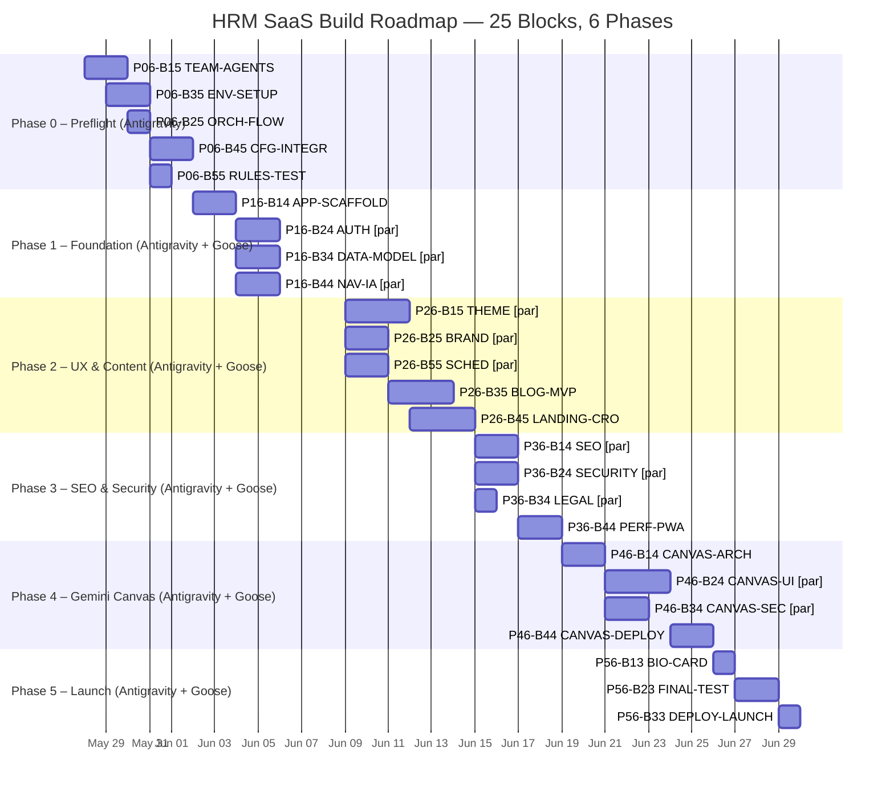

# HRM SaaS Development Roadmap — Gantt Chart
> Google Antigravity on Windows | `[par]` = simultaneous agent sessions | ~30-day sprint

## Parallel Execution Rules (from Goose prompts)

| Phase | Parallel Group | Blocks | Dependency |
|-------|---------------|--------|------------|
| P1 | Group A | P16-B24 AUTH, P16-B34 DATA, P16-B44 NAV | All after P16-B14 completes |
| P2 | Group B | P26-B15 THEME, P26-B25 BRAND, P26-B55 SCHED | Start together day 9 |
| P2 | Group C | P26-B35 BLOG, P26-B45 LANDING | After Group B stable |
| P3 | Group D | P36-B14 SEO, P36-B24 SECURITY, P36-B34 LEGAL | Start together day 15 |
| P4 | Group E | P46-B24 CANVAS-UI, P46-B34 CANVAS-SEC | Both after P46-B14 arch |

---

## Mermaid Gantt

---

## Notes
- Paste this Mermaid block into any Markdown renderer (GitHub, Notion, Antigravity docs) to see the visual chart.
- `[par]` blocks are dispatched to separate Antigravity Agent Manager sessions simultaneously.
- Each block ends with a commit, push, and pull-request review before Goose advances the phase.
- Total estimated sprint: 30 working days from project kickoff.
