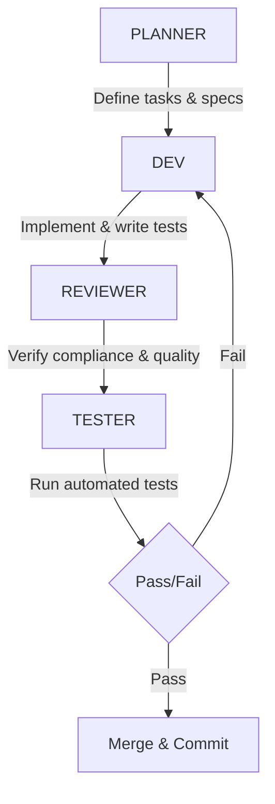

# HRM SaaS Orchestration Architecture

This document governs the multi-agent orchestration workflow for building the HRM SaaS.

---

## 1. Core Workflow Cycle
Every building block undergoes a strict, sequential 4-stage pipeline:

1. **Planner (`[PLANNER]`)**: Analyzes the block specification, identifies required files, reviews dependency status, and outlines the precise tasks and file modifications.
2. **Developer (`[DEV]`)**: Executes the code changes in TypeScript, creates responsive UI components using Tailwind CSS 4, and builds corresponding unit/smoke tests.
3. **Reviewer (`[REVIEWER]`)**: Audits the code diff for security (no hardcoded secrets, RLS enabled), licensing compliance, naming conventions, and payment display rules.
4. **Tester (`[TESTER]`)**: Runs `pnpm lint`, `pnpm test`, and `pnpm build` to verify standard compliance and zero regression before any production push.

---

## 2. Hard Orchestration Rules

- **Block ID Requirement**: No developer agent may make any code edits without an explicit Block ID (e.g. `P16-B14APP-SCAFFOLD`) and verified planning instruction.
- **Dependency Isolation**: Independent blocks may run concurrently across parallel agent sessions. Dependent blocks must wait until their precursor blocks are marked `completed` in `docs/phase0-status.json`.
- **Persona Invocation**: Agents must invoke specialized behaviors using prefix tags: `[PLANNER]`, `[DEV]`, `[REVIEWER]`, `[TESTER]`, `[DOCS]`, and `[RESEARCH]`.

---

## 3. Parallelization & Handoff Schema

When multiple agents run in parallel (e.g., Phase 1 Group A):
- Files must be edited inside isolated, non-overlapping directories to prevent git conflicts.
- In case of mutual file edits (such as updating central routing or configuration), updates must be serialized sequentially and documented in the block status notes.
